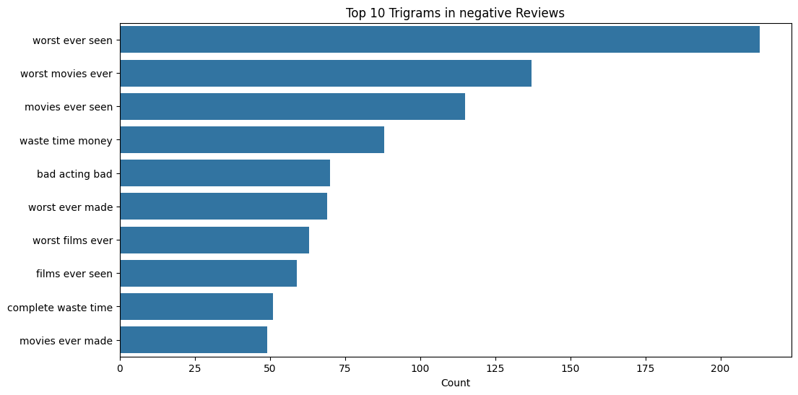

# Sentiment Analysis of IMDB Movie Reviews: Technical Report

## 1. Executive Summary

This report details the process and results of a sentiment analysis project conducted on the IMDB movie review dataset. The objective was to develop machine learning models capable of classifying reviews as positive or negative based on the review text. We implemented and compared several models, including traditional machine learning approaches, deep learning techniques, and a novel LLM Agent approach.

Key findings:
- The BERT model achieved the highest accuracy among traditional deep learning models
- The LLM Agent approach using OpenAI API and Langchain showed promising results but comes with associated costs
- Preprocessing steps, particularly lemmatization and stemming, had varying impacts on model performance
- Common words and phrases in positive and negative reviews were identified through word cloud and n-gram analysis

### Project Setup
Before running the code for this project, ensure that all required libraries are installed. Execute the following command in your terminal or command prompt to install all necessary dependencies:

```pip install -r requirements.txt```

__Note__: Make sure you have Python and pip installed on your system before running this command. It's recommended to use a virtual environment to avoid conflicts with other projects.

## 2. Introduction

Sentiment analysis plays a crucial role in understanding public opinion about movies. This project aims to automate the process of classifying movie reviews as positive or negative, providing valuable insights for the film industry.

### 2.1 Dataset Overview

The dataset consists of IMDB movie reviews, with scores ranging from 1 to 10. Reviews were labeled as follows:
- Positive: Scores 7-10
- Negative: Scores 1-4

The dataset contains the following fields: 'review', 'sentiment', and 'score'.

### 2.2 Project Objectives

1. Preprocess and clean the text data
2. Analyze the distribution and characteristics of the reviews
3. Implement and compare various sentiment analysis models
4. Evaluate model performance and identify the best-performing approach

## 3. Data Analysis and Preprocessing

### 3.1 Data Distribution


The dataset has an equal number of positive and negative sentiments, ensuring a balanced classification problem.


### 3.2 Data Preprocessing

1. Removal of unwanted elements:
   - Used regular expressions to identify and remove HTML tags (e.g., ```</br>, </i>```)

2. Length analysis:
   
   
   
   
   The plot shows there is not much difference between the length of the both positive and negative reviews..

3. Word Cloud Analysis:

    

   - Generated word clouds for positive and negative reviews, as well as score-wise
   - Common words across all reviews: 'film', 'movie', 'one'
   - Positive reviews: frequent words include 'good', 'great'
   - Negative reviews: frequent words include 'bad', 'badmake'
   - 'character' appears frequently in all reviews, suggesting its importance in movie judgments

4. N-gram Analysis:
   - Plotted top 10 bigrams and trigrams for both negative and positive reviews
    ### Bigrams
    
    
    ### Trigrams
    
    

5. Text Normalization:
   - Applied lemmatization using NLTK's WordNetLemmatizer
   - Applied stemming using Porter Stemmer

## 4. Model Implementation

I implemented and compared the following models:

### 4.1 Traditional Machine Learning Models

1. Naive Bayes
2. Logistic Regression
3. Random Forest

### 4.2 Deep Learning Models

4. Bidirectional Encoder Representations from Transformers (BERT)
5. Long Short-Term Memory (LSTM)

### 4.3 Novel Approach

6. LLM Agent using OpenAI API and Langchain

## 5. Results

### 5.1 Traditional Machine Learning Models

1. Naive Bayes
   - Best parameters for all text types: {'alpha': 2.0}
   - Hyperparameter tuning was performed using GridSearchCV, exploring different alpha values
   <table>
   <thead>
    <td></td>
    <td>Lemmatized</td>
    <td>Stemmed</td>
    <td>Normal</td>
   </thead>
   <tbody>
   <tr>
    <td>Classification Report</td>
   <td></img></td>
   <td></img></td>
   <td></img></td>
   </tr>
   <tr>
    <td>Confusion Matrix</td>
   <td></img></td>
   <td></img></td>
   <td></img></td>
   </tr>
   </tbody>
   </table>

2. Logistic Regression
   - Best parameters for all text types: {'C': 1, 'penalty': 'l1'}
   - GridSearchCV was used to tune the C parameter and penalty type
   <table>
   <thead>
    <td></td>
    <td>Lemmatized</td>
    <td>Stemmed</td>
    <td>Normal</td>
   </thead>
   <tbody>
   <tr>
    <td>Classification Report</td>
   <td></img></td>
   <td></img></td>
   <td></img></td>
   </tr>
   <tr>
    <td>Confusion Matrix</td>
   <td></img></td>
   <td></img></td>
   <td></img></td>
   </tr>
   </tbody>
   </table>

3. Random Forest
   - Best parameters for all text types: {'max_depth': None, 'n_estimators': 200}
   - Hyperparameters were tuned using GridSearchCV, exploring different max_depth and n_estimators values
   <table>
   <thead>
    <td></td>
    <td>Lemmatized</td>
    <td>Stemmed</td>
    <td>Normal</td>
   </thead>
   <tbody>
   <tr>
    <td>Classification Report</td>
   <td></img></td>
   <td></img></td>
   <td></img></td>
   </tr>
   <tr>
    <td>Confusion Matrix</td>
   <td></img></td>
   <td></img></td>
   <td></img></td>
   </tr>
   </tbody>
   </table>

### 5.2 Deep Learning Models

4. BERT
   BERT (Bidirectional Encoder Representations from Transformers) has demonstrated superior performance in this sentiment analysis task, outperforming all other models. Its success can be attributed to its pre-training on a large corpus of text and its ability to capture contextual information bidirectionally. BERT's architecture allows it to understand the nuances of language, including complex sentence structures and subtle sentiment cues, which are particularly important in movie reviews where context is crucial.

   <table>
   <thead>
    <td>Classification Report</td>
    <td>Confusion Matrix</td>
   </thead>
   <tbody>
   <tr>
   <td></img></td>
   <td></img></td>
   </tr>
   </tbody>
   </table>


### 5.3 Novel Approach

6. LLM Agent
   The LLM Agent, leveraging OpenAI's API and the Langchain library, represents a cutting-edge approach to sentiment analysis. This method harnesses the power of large language models, which have been trained on vast amounts of text data, enabling them to understand and analyze sentiment with remarkable accuracy.

   Key advantages of this approach include:
   - Ability to understand complex language patterns and context
   - Potential for zero-shot learning, reducing the need for task-specific training data
   - Flexibility to adapt to various types of text and sentiment nuances

   However, it's important to note that this approach comes with associated costs, as it requires an OpenAI API key, which has a minimum cost of $5. This cost factor should be considered when evaluating the scalability and long-term feasibility of this approach for large-scale sentiment analysis tasks.

   <table>
   <thead>
    <td>Classification Report</td>
    <td>Confusion Matrix</td>
   </thead>
   <tbody>
   <tr>
   <td></img></td>
   <td></img></td>
   </tr>
   </tbody>
   </table>

## 6. Conclusions and Future Work

The BERT model and the LLM Agent approach demonstrated superior performance in sentiment classification of movie reviews. The LLM Agent, while highly effective, introduces cost considerations that need to be weighed against its performance benefits.

Future work could explore:
1. Fine-tuning BERT on a larger movie review dataset
2. Investigating cost-effective ways to leverage LLM capabilities for sentiment analysis
3. Exploring ensemble methods combining the strengths of different models
4. Conducting a more detailed analysis of misclassified reviews to identify areas for improvement